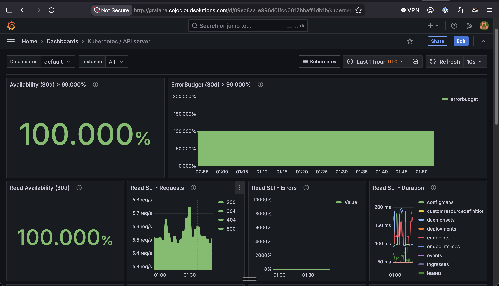
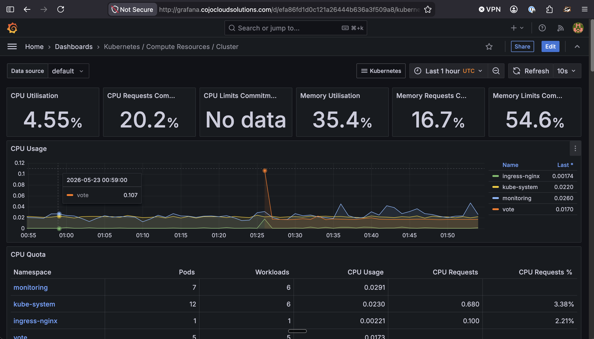
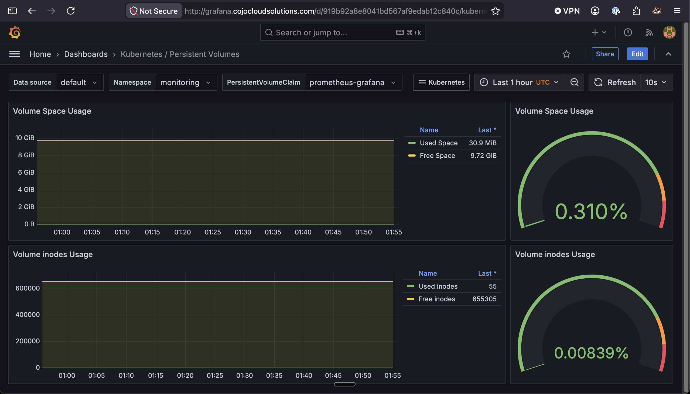
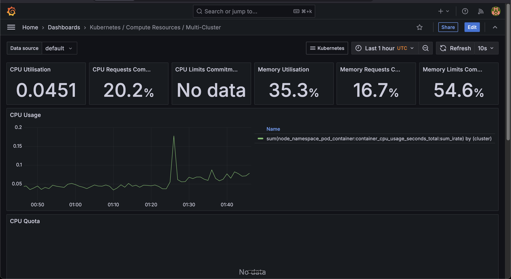
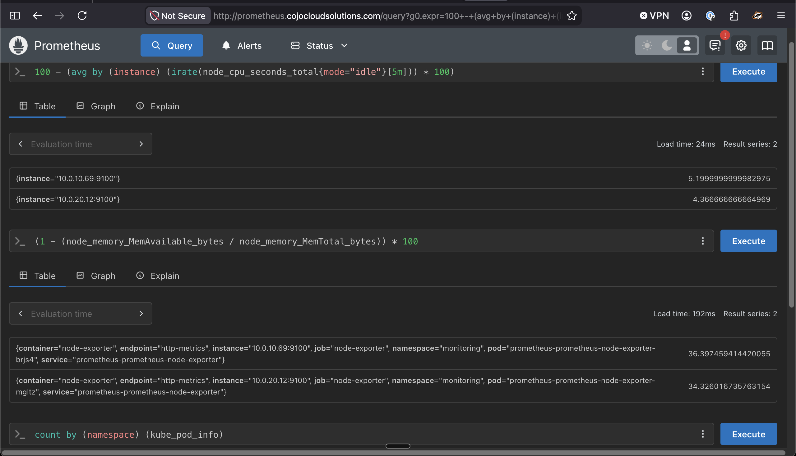

# EKS Observability Stack: Prometheus & Grafana with Terraform and Helm

A production-ready observability platform deployed on Amazon EKS using Terraform. This project provisions an EKS cluster, installs the full Prometheus + Grafana monitoring stack via Helm, configures Route53 DNS, and deploys a sample microservices application to observe.

Live stack: [prometheus.cojocloudsolutions.com](http://prometheus.cojocloudsolutions.com) | [grafana.cojocloudsolutions.com](http://grafana.cojocloudsolutions.com)

---

## What is Observability on EKS?

Observability in Kubernetes goes beyond traditional monitoring. It answers not just *"Is my system working?"* but *"Why is it not working?"*

The three pillars:
- **Metrics** — quantitative data over time (CPU, memory, request counts)
- **Logs** — textual event records (pod logs, system events)
- **Traces** — request paths across microservices (distributed tracing)

This project covers the **metrics** pillar end-to-end with Prometheus and Grafana.

---

## Architecture

```
┌─────────────────────────────────────────────────────────────────────┐
│                         AWS Cloud (us-east-1)                      │
│                                                                    │
│  ┌─────────────────────────────────────────────────────────────┐   │
│  │                    EKS Cluster (1.32)                       │   │
│  │                                                             │   │
│  │  ┌─────────────────┐    ┌─────────────────┐                 │   │
│  │  │   Prometheus    │◄───┤  Node Exporter  │                 │   │
│  │  │     Server      │    │  (per node)     │                 │   │
│  │  │  - Scrapes      │    └─────────────────┘                 │   │
│  │  │  - Stores 30d   │                                        │   │
│  │  │  - Alert rules  │    ┌─────────────────┐                 │   │
│  │  └────────┬────────┘◄───┤ kube-state-     │                 │   │
│  │           │             │ metrics         │                 │   │
│  │           ▼             └─────────────────┘                 │   │
│  │  ┌─────────────────┐                                        │   │
│  │  │    Grafana      │    ┌─────────────────┐                 │   │
│  │  │  - Dashboards   │◄───┤  AlertManager   │                 │   │
│  │  │  - Persistence  │    │  - CrashLoop    │                 │   │
│  │  └─────────────────┘    │  - HighCPU      │                 │   │
│  │                         │  - NodeNotReady │                 │   │
│  │  ┌─────────────────┐    └─────────────────┘                 │   │
│  │  │  NGINX Ingress  │──► Route53 DNS → NLB                   │   │
│  │  │  (NLB-backed)   │                                        │   │
│  │  └─────────────────┘                                        │   │
│  └─────────────────────────────────────────────────────────────┘   │
│                                                                    │
│  S3 (Terraform state) │ VPC │ Private + Public Subnets │ NAT GW    │
└─────────────────────────────────────────────────────────────────────┘
```

---

## Stack

| Component | Tool | Version |
|---|---|---|
| Infrastructure as Code | Terraform | >= 1.0 |
| Kubernetes | Amazon EKS | 1.32 |
| Metrics collection | Prometheus (kube-prometheus-stack) | chart 67.9.0 |
| Visualization | Grafana | bundled with above |
| Alerting | AlertManager | bundled with above |
| Ingress | NGINX Ingress Controller | 4.8.3 |
| DNS | AWS Route53 | — |
| Sample app | Voting App (microservices) | — |

---

## What I Improved Over a Standard Setup

This project goes beyond a basic Prometheus/Grafana install:

1. **Sensitive variable for Grafana password** — no hardcoded credentials anywhere in the codebase; the password is passed as a `sensitive` Terraform variable and never emitted in plaintext outputs.
2. **Grafana persistence** — dashboards survive pod restarts via an EBS-backed PVC (10Gi, `gp2`). The common mistake of leaving `persistence.enabled = false` means losing all custom dashboards on every restart.
3. **Custom AlertManager rules** — three alert groups out of the box: `PodCrashLooping`, `PodNotReady`, `NodeNotReady`, `HighCPUUsage`, `HighMemoryUsage`. Most tutorials skip this, but it's why you set up alerting in the first place.
4. **NGINX metrics scraped by Prometheus** — `serviceMonitor.enabled = true` means NGINX request/error/latency metrics flow into Prometheus and are visible in Grafana dashboards.
5. **API endpoint CIDR restriction** — `cluster_endpoint_public_access_cidrs` variable lets you lock down who can reach the EKS API server instead of leaving it open to `0.0.0.0/0`.
6. **`domain_name` variable** — the domain is no longer scattered across files as a hardcoded string; all DNS records and ingress hosts reference `var.domain_name`.
7. **`terraform.tfvars.example`** — a committed example file documents every personal value so anyone cloning the repo knows exactly what to configure.

---

## Prerequisites

| Tool | Min Version |
|------|-------------|
| AWS CLI | v2 |
| Terraform | >= 1.0 |
| kubectl | >= 1.28 |
| Helm | >= 3.0 |

AWS credentials must be configured (`aws configure`) and the calling identity needs permissions to create EKS, VPC, IAM, and ELB resources.

---

## Quick Start

```bash
# Deploy everything end-to-end (~15-20 min)
./deploy.sh

# Tear everything down when done
./cleanup.sh
```

---

## Deployment

### Automated (recommended)

```bash
./deploy.sh
```

The script handles the full deployment in order:

| Step | Action |
|------|--------|
| 1 | Verifies `aws`, `terraform`, `kubectl`, `helm` are installed |
| 2 | Validates AWS credentials |
| 3 | Creates the S3 state bucket with versioning and encryption (idempotent) |
| 4 | Creates `terraform.tfvars` from the example if missing, prompting for your Grafana password and IP CIDR |
| 5 | Adds and updates Helm repositories |
| 6 | Runs `terraform init` |
| 7 | Runs `terraform plan` and pauses for your review before applying |
| 8 | Runs `terraform apply` (~15–20 min) |
| 9 | Updates kubeconfig |
| 10 | Waits for all nodes to reach `Ready` |
| 11 | Waits for monitoring pods and prints the NLB hostname |
| 12 | Optionally deploys the example voting app |
| — | Prints a final summary with URLs, port-forward commands, and DNS CNAME instructions |

### Manual

<details>
<summary>Click to expand manual steps</summary>

**1. Configure your variables**
```bash
cd infrastructure
cp terraform.tfvars.example terraform.tfvars
# Edit terraform.tfvars with your domain, cluster name, and Grafana password
```

**2. Add Helm repositories**
```bash
helm repo add prometheus-community https://prometheus-community.github.io/helm-charts
helm repo add grafana https://grafana.github.io/helm-charts
helm repo add ingress-nginx https://kubernetes.github.io/ingress-nginx
helm repo update
```

**3. Deploy infrastructure**
```bash
cd infrastructure
terraform init
terraform plan
terraform apply
```

**4. Update kubeconfig**
```bash
aws eks --region us-east-1 update-kubeconfig --name CojoCloud-EKS-Cluster
```

**5. Deploy the sample voting app**
```bash
cd example-voting-app/k8s-specifications
kubectl apply -f .
kubectl apply -f .   # run twice — namespace is created on the first pass
```

</details>

### DNS (manual — required regardless of deployment method)

Terraform does not create DNS records. After apply, get the NLB hostname:

```bash
kubectl get svc -n ingress-nginx ingress-nginx-controller \
  -o jsonpath='{.status.loadBalancer.ingress[0].hostname}'
```

Add CNAME records at your registrar pointing at that hostname:

| Name | Type | Value |
|------|------|-------|
| `prometheus` | CNAME | `<nlb-hostname>` |
| `grafana` | CNAME | `<nlb-hostname>` |
| `vote` | CNAME | `<nlb-hostname>` |
| `result` | CNAME | `<nlb-hostname>` |

---

## Accessing the Stack

| Service | URL |
|---|---|
| Prometheus | http://prometheus.cojocloudsolutions.com |
| Grafana | http://grafana.cojocloudsolutions.com |
| Vote app | http://vote.cojocloudsolutions.com |
| Results app | http://result.cojocloudsolutions.com |

**Grafana login:** username `admin`, password set in `terraform.tfvars`.

Or via port-forward (no DNS required):
```bash
# Prometheus
kubectl port-forward -n monitoring svc/prometheus-kube-prometheus-prometheus 9090:9090

# Grafana
kubectl port-forward -n monitoring svc/prometheus-grafana 3000:80
```

---

## Validation

### Check Prometheus targets
Go to **Status → Targets** — all targets should show `UP`.

### Sample PromQL queries

```promql
# CPU usage by node
100 - (avg by (instance) (irate(node_cpu_seconds_total{mode="idle"}[5m])) * 100)

# Memory usage
(1 - (node_memory_MemAvailable_bytes / node_memory_MemTotal_bytes)) * 100

# Pod count by namespace
count by (namespace) (kube_pod_info)

# NGINX request rate (requires serviceMonitor)
rate(nginx_ingress_controller_requests[5m])
```

### Recommended Grafana dashboards to import

| Dashboard | ID |
|---|---|
| Kubernetes / Compute Resources / Cluster | 315 |
| Kubernetes / Compute Resources / Namespace | 3146 |
| Kubernetes / Compute Resources / Pod | 7633 |
| Node Exporter Full | 1860 |
| NGINX Ingress Controller | 9614 |
| ETCD Metrics | 3070 |

---

## Outcomes

### Kubernetes API Server — 100% Availability


### Cluster Compute Resources — CPU & Memory by Namespace


### Persistent Volumes — Grafana PVC


### Multi-Cluster Compute Resources Overview


### Prometheus — Live PromQL Queries


---

## Cleanup

### Automated (recommended)

```bash
./cleanup.sh
```

The script tears down the stack in the correct order:

| Step | Action |
|------|--------|
| 1 | Requires explicit confirmation before proceeding |
| 2 | Refreshes kubeconfig (skips gracefully if cluster is already gone) |
| 3 | Deletes the `vote` namespace if it exists |
| 4 | Finds NLBs scoped to the cluster's VPC, deletes them, and waits for full deletion before continuing |
| 5 | Runs `terraform destroy -auto-approve` |
| 6 | Detects any leftover EC2 instances tagged with the cluster name and offers to terminate them, then re-runs destroy if needed |
| — | Prints instructions for manually deleting the S3 state bucket and any KMS keys |

> **Note:** The S3 state bucket and any KMS keys are not managed by Terraform and will not be deleted by the script. Instructions are printed at the end. KMS keys have a minimum 7-day deletion waiting period.

### Manual

<details>
<summary>Click to expand manual steps</summary>

```bash
# 1. Remove the voting app
kubectl delete namespace vote

# 2. Delete the NLB created by the nginx ingress controller (Kubernetes-managed, not Terraform)
NLB_ARN=$(aws elbv2 describe-load-balancers --region us-east-1 \
  --query "LoadBalancers[?VpcId=='<your-vpc-id>' && Type=='network'].LoadBalancerArn" \
  --output text)
aws elbv2 delete-load-balancer --load-balancer-arn $NLB_ARN --region us-east-1

# Wait for the NLB to be fully deleted before continuing
until [ $(aws elbv2 describe-load-balancers --region us-east-1 \
  --query "length(LoadBalancers[?VpcId=='<your-vpc-id>'])" --output text) -eq 0 ]; do sleep 10; done

# 3. Destroy all Terraform-managed infrastructure
cd infrastructure
terraform destroy
```

If `terraform destroy` fails on VPC/subnet deletion, EC2 node instances may still be running:
```bash
aws ec2 describe-instances \
  --filters "Name=tag:aws:eks:cluster-name,Values=CojoCloud-EKS-Cluster" \
            "Name=instance-state-name,Values=running" \
  --query "Reservations[*].Instances[*].InstanceId" --output text
aws ec2 terminate-instances --instance-ids <id1> <id2> --region us-east-1
```
Then re-run `terraform destroy`.

</details>

---

## References

- [Prometheus Documentation](https://prometheus.io/docs/)
- [Grafana Documentation](https://grafana.com/docs/)
- [kube-prometheus-stack Helm Chart](https://github.com/prometheus-community/helm-charts/tree/main/charts/kube-prometheus-stack)
- [Amazon EKS User Guide](https://docs.aws.amazon.com/eks/latest/userguide/)
- [Prometheus Operator Documentation](https://prometheus-operator.dev/)
- [Kubernetes Monitoring Best Practices](https://kubernetes.io/docs/concepts/cluster-administration/monitoring/)
